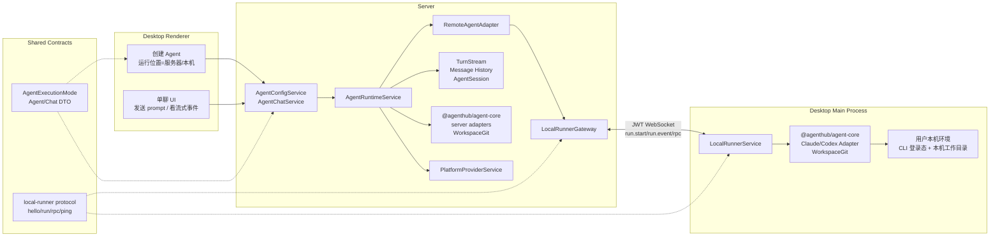
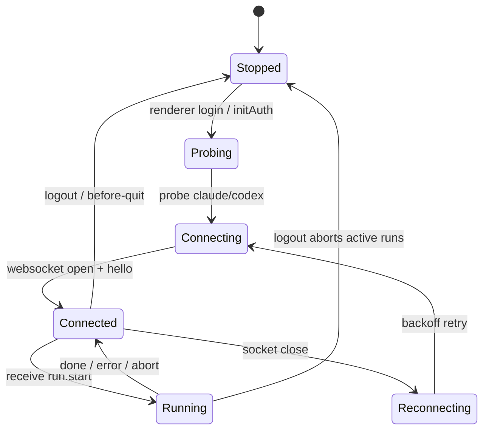
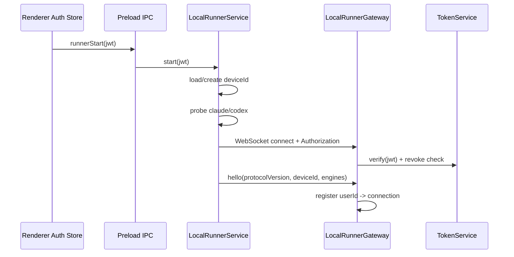
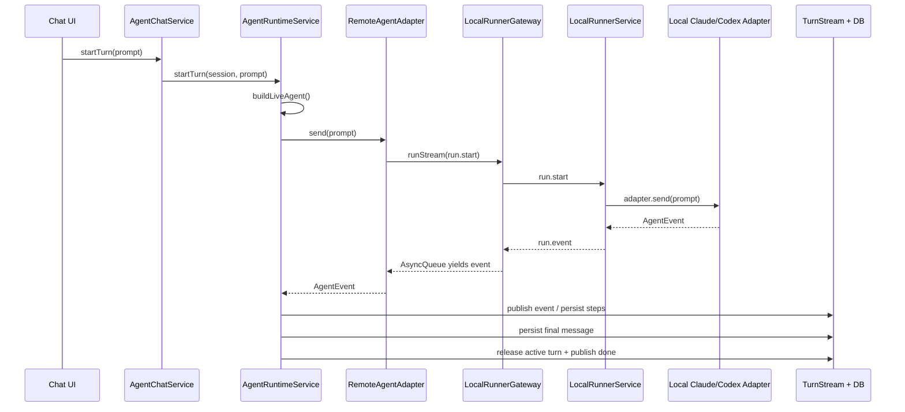
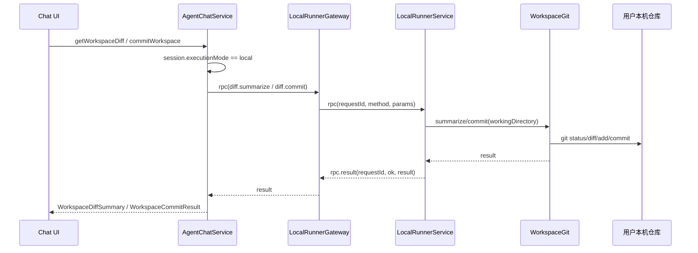

# 本地 Agent 介入实现方案

> 适用范围：AgentHub 单聊 Agent 的本地执行模式
>
> 目标读者：后续维护 server / desktop / shared / agent-core 的开发者
>
> 定位：说明「接入用户本地 Claude Code / Codex」这套方案如何落地，包括设计取舍、模块职责、协议流转、运行流程和边界风险。

---

## 1. 要解决的问题

AgentHub 原本的单聊执行链路是 server-only：用户创建 Agent 后，服务器根据 `platformProviderId` 解析 API key / baseUrl，在服务器进程内创建 Claude 或 Codex adapter，并让 Agent 操作服务器上的工作目录。

「本地 Agent 介入」要增加另一种执行位置：

- 用户在桌面端创建 Agent 时选择「在本机运行」。
- 实际 Claude Code / Codex 调用发生在用户电脑上的 AgentHub Desktop 主进程。
- Agent 操作的是用户本机目录。
- Claude / Codex 使用用户本机 CLI 的登录态，例如 `~/.claude`、`~/.codex`。
- 服务器仍负责鉴权、Agent/Chat 配置、turn 生命周期、消息历史、流式事件分发和 UI 同步。

这意味着不能简单地把 SDK 调用搬到 renderer，也不能让服务器直接访问用户机器。方案采用「桌面端主动连服务器的反向通道」：桌面端建立一条 JWT 鉴权 WebSocket，服务器通过这条连接下发 run / abort / diff / commit 指令，桌面端在本机执行后把事件和结果回传。

---

## 2. 设计原则

1. **默认行为不变**：不选择 local 的 Agent 仍走原来的 server 执行路径。
2. **只改唯一分叉点**：单聊真正的执行分叉点是 `AgentRuntimeService.buildLiveAgent()`，上层 `runTurn()` 不应知道 Agent 到底跑在 server 还是 desktop。
3. **本地 runner 在 desktop main process**：本地执行需要 Node 子进程、文件系统、git、ESM SDK 和本机环境变量，落点必须是 Electron main process。
4. **adapter 与 git 逻辑框架无关**：server 和 desktop 都要复用 Claude/Codex adapter 与 workspace git 能力，因此要抽到 `packages/agent-core`。
5. **协议先行**：server 与 desktop 的反向通道消息定义放在 `packages/shared`，避免两端各写各的。
6. **v1 只做单聊**：群聊成员执行、Orchestrator 调度、worktree merge 等复杂协作能力保持 server 模式，避免本地文件系统和多人共享工作区在 v1 混在一起。
7. **本地模式不传 Provider 凭据**：local Agent 不引用服务器 `platformProviderId`，不把 API key / baseUrl 下发到桌面端。

---

## 3. 总体架构



核心思路是：server 不直接执行 local Agent，也不直接碰用户文件系统；server 只把「一次 Agent 调用」封装成协议消息发给 desktop runner。desktop runner 执行后，把统一 `AgentEvent` 流原样回传。这样 server 的 turn runtime 仍消费同一套事件，不需要重新写聊天执行逻辑。

---

## 4. 分阶段落地

### Phase 0：抽取共享执行核心 `packages/agent-core`

本地执行的前提是 desktop main process 能复用 server 原有执行能力。原本这些能力耦合在 server 模块里：

- Claude adapter
- Codex adapter
- adapter types / capabilities / factory
- workspace diff / commit 里的纯 git 逻辑
- Nest Logger / BusinessException 等 server 框架依赖

重构方式：

```text
apps/server/src/multiagents/adapter/*  ─┐
apps/server/src/multiagents/workspace/* ─┼─> packages/agent-core
                                         │
server wrapper <─────────────────────────┘
desktop runner <─────────────────────────┘
```

`packages/agent-core` 应只依赖 Node 与 SDK，不依赖 Nest / Electron renderer / 业务数据库：

```text
packages/agent-core/
  src/
    adapter/
      types.ts
      capabilities.ts
      claude.ts
      codex.ts
      index.ts          # createAgent(vendor, config)
    workspace/
      workspace-git.ts  # diff / checkpoint / commit
    logger.ts           # CoreLogger + NOOP_LOGGER
```

关键改造点：

- 用 `CoreLogger` 替换 `@nestjs/common` Logger。
- adapter 抛出的事件统一保持 `AgentEvent`。
- 本地模式下 `apiKey` 可为空字符串，让 adapter 不注入 API key，而是使用 CLI ambient auth。
- `WorkspaceGit` 抛普通 `Error`；server 侧再映射为 `BusinessException`。
- server 原 adapter 目录保留一个 re-export barrel，降低上层改动。

落地结果：

- server 模式继续使用同一套 adapter，只是从新包 import。
- desktop runner 可以在 Electron main process 里直接调用 `createAgent()` 与 `WorkspaceGit`。
- diff/commit 的行为在 server 与 local 两种执行位置保持一致。

### Phase 1：定义 shared 协议与执行位置类型

需要把「运行位置」和「反向通道」定义为双端共享契约。

新增核心类型：

```ts
export type AgentExecutionMode = 'server' | 'local'
```

该字段进入：

- `AgentView`
- `AgentChatView`
- `CreateAgentPayload`
- server DTO / entity mapper
- renderer 创建 Agent 表单

local Agent 的 DTO 语义与 server Agent 不同：

| 字段 | server 模式 | local 模式 |
| --- | --- | --- |
| `platformProviderId` | 必填，用于解析 API key/baseUrl | 省略或为 `null` |
| `model` | 必填，校验 provider model list | 可选，可使用本机 CLI 默认模型 |
| `workingDirectory` | 服务器 workspace 根内路径 | 用户本机绝对路径 |
| `agentHomeDirectory` | 服务器分配或校验 | 服务器不管理，由 desktop 解析 |
| `skillSourceDirectories` | 可导入服务器 skill 目录 | 不支持，由本机环境发现 |

反向通道协议放在 `packages/shared/src/local-runner.ts`。协议分为两组消息：

```text
desktop -> server
  hello
  run.event
  rpc.result
  pong

server -> desktop
  run.start
  run.abort
  rpc
  ping
```

其中 `run.start` 是一次本机 Agent 调用的完整描述：

```ts
{
  type: 'run.start',
  runId,
  vendor,
  prompt,
  config,
  resumeSessionId?,
  outputSchema?
}
```

`config` 是 `AgentAdapterConfig` 的安全子集，不包含：

- `apiKey`
- `baseUrl`
- `agentHomeDirectory`

这些由本机环境决定，避免服务器凭据进入用户机器，也避免 server 假设用户本机目录结构。

RPC v1 覆盖文件侧能力：

| RPC | 用途 |
| --- | --- |
| `dir.ensure` | 确认或创建用户本机工作目录。 |
| `diff.checkpoint` | 记录当前本机仓库基线，避免把建聊前已有改动算作本轮产物或待提交变更。 |
| `diff.summarize` | 在本机仓库计算 diff 摘要。 |
| `diff.commit` | 在本机仓库提交工作区变更。 |

后续可以在同一协议上继续扩展 artifact preview、artifact write 等文件能力，但核心模型不变：server 发 RPC，desktop 在本机工作目录内执行并回传结果。

### Phase 2：server 侧接入反向通道

server 侧需要新增两个核心组件：

```text
LocalRunnerGateway
RemoteAgentAdapter
```

#### LocalRunnerGateway

`LocalRunnerGateway` 是 server 侧 WebSocket 服务。职责：

- 监听 runner WebSocket 端口。
- 校验桌面端 JWT。
- 等待首包 `hello`，校验协议版本。
- 维护 `userId -> RunnerConnection` 注册表。
- 记录连接设备的 `deviceId`、`deviceName`、可用 `engines`。
- 把 desktop push 的 `run.event` 转成 server 可 pull 的 async stream。
- 管理 RPC 的 `requestId -> resolver` 配对与超时。
- 在断线时关闭 run 队列、reject pending RPC。

连接模型：

```text
userId
  -> RunnerConnection
       socket
       deviceId
       engines: { claude, codex }
       runs: Map<runId, AsyncQueue<AgentEvent>>
       pendingRpc: Map<requestId, resolver>
```

v1 策略：一个用户只保留一个活跃 runner。新连接顶替旧连接，旧连接上的 run/RPC 统一失败收尾。

#### RemoteAgentAdapter

`RemoteAgentAdapter` 实现与 Claude/Codex adapter 相同的 `AgentAdapter` 接口，但它不直接调用 SDK。

```text
AgentAdapter.send(prompt)
  -> gateway.runStream(userId, run.start)
  -> for await run.event
  -> yield AgentEvent to AgentRuntimeService
```

它负责：

- 将 `send(prompt)` 转成 `run.start`。
- 下发 `resumeSessionId` 和 `outputSchema`。
- 捕获回流的 `session_started`，维护 `sessionId`。
- 保证流最终出现 `done`。如果连接中断或异常导致没收到 `done`，补一条 `done(success=false)`。
- 把 `AbortSignal` 转成 `run.abort`。

这样 `AgentRuntimeService.runTurn()` 不需要知道当前 adapter 是本地 SDK adapter 还是 remote adapter。

#### Runtime 分叉

`AgentRuntimeService.buildLiveAgent()` 按 Agent 执行位置分叉：

```text
executionMode == server
  -> resolve Provider
  -> agentToConfig(agent, session, apiKey, baseUrl)
  -> createAgent(vendor, config)

executionMode == local
  -> assert runner connected
  -> build LocalRunConfig
  -> new RemoteAgentAdapter(vendor, gateway, userId, config)
```

server 模式继续要求 `platformProviderId` 可用；local 模式跳过 Provider 解析。

`runTurn()` 保持原流程：

1. 获取或重建 LiveAgent。
2. 获取 active turn lock。
3. 调用 `adapter.send(prompt)`。
4. 把 `AgentEvent` 发布到 turn stream。
5. 收集 text / step / usage。
6. 保存用户消息、Agent 消息与步骤。
7. 保存底层 `sdkSessionId`。
8. 释放 active turn。
9. 发布最终 `done`。

local 模式只改变第 1 步里 adapter 的创建方式。

#### Agent / Chat 创建分叉

创建 Agent 时：

```text
CreateAgentDto.executionMode ?? 'server'
  server -> createServerAgent()
  local  -> createLocalAgent()
```

local Agent：

- 不校验服务器 workspace root。
- 不解析 Provider。
- `platformProviderId = null`。
- `agentHomeDirectory` 存空串占位。
- `workingDirectory` 原样保存为用户本机路径。
- 不允许导入 server skill source directories。

创建 Chat 时：

```text
agent.executionMode == server
  -> 分配/校验服务器 workingDirectory
  -> 分配 sessionHomeDirectory
  -> 同步 vendor config / skills
  -> server WorkspaceDiffService.markCheckpoint()

agent.executionMode == local
  -> workingDirectory 使用用户本机路径
  -> sessionHomeDirectory 为空
  -> best-effort rpc(dir.ensure)
  -> best-effort 建立本机 diff 基线
```

diff / commit 时：

```text
session.executionMode == server
  -> WorkspaceDiffService.summarize/commit(server path)

session.executionMode == local
  -> assert runner connected
  -> LocalRunnerGateway.rpc('diff.summarize' / 'diff.commit')
```

### Phase 3：desktop 侧实现本地 runner 与 UI

desktop main process 新增 `LocalRunnerService`。

生命周期：



主要职责：

- 登录后由 renderer auth store 通过 preload IPC 调用 `runner:start(token)`。
- 登出或退出前调用 `runner:stop`。
- 生成并持久化稳定 `deviceId`。
- 用 `claude --version` / `codex --version` 探测本机引擎。
- 建立带 `Authorization: Bearer <JWT>` 的 WebSocket。
- 连接打开后发送 `hello`。
- 收到 `run.start` 后用 `packages/agent-core.createAgent()` 创建本机 adapter。
- 将本机 adapter 的事件逐条包装成 `run.event` 发回 server。
- 收到 `run.abort` 后 abort 对应 run。
- 收到 `rpc` 后在本机执行 `WorkspaceGit` 操作，并用 `rpc.result` 回传。
- 断线后指数退避重连。

本机 adapter 配置映射：

```text
LocalRunConfig
  -> AgentAdapterConfig
       model              # 可省略，让本机 CLI 用默认模型
       workingDirectory   # 用户本机目录
       apiKey = ''        # 不注入服务器 key
       agentHomeDirectory # desktop 按 vendor 映射到本机配置目录
```

vendor home 解析：

| vendor | desktop 传给 adapter 的 home | 目的 |
| --- | --- | --- |
| Claude | `homedir()` | adapter 内部命中 `~/.claude`。 |
| Codex | `~/.codex` | 命中本机 Codex home。 |

renderer UI：

- 创建 Agent 对话框增加「运行位置」。
- server 模式显示 Provider 选择器。
- local 模式隐藏 Provider，说明使用本机 CLI 登录态。
- local 模式的目录选择器调用 Electron OS directory dialog。
- local Agent 创建后暂不支持编辑运行位置和本地路径。

---

## 5. 核心运行流程

### 5.1 本地 runner 建连



### 5.2 本地 turn 执行



### 5.3 本地 diff / commit



---

## 6. 数据模型

### 6.1 Agent

| 字段 | server 模式 | local 模式 |
| --- | --- | --- |
| `executionMode` | `'server'` | `'local'` |
| `platformProviderId` | Provider id | `null` |
| `model` | Provider model | 显式模型或本机默认模型占位 |
| `agentHomeDirectory` | 服务器 agent home | 空串占位 |
| `workingDirectory` | 服务器 workspace 路径 | 用户本机路径 |

### 6.2 AgentSession

| 字段 | server 模式 | local 模式 |
| --- | --- | --- |
| `executionMode` | `'server'` | `'local'` |
| `sessionHomeDirectory` | 服务器 session home | 空串占位 |
| `sdkSessionId` | server SDK 会话 id | 本机 SDK 会话 id，仍由 server 记录 |
| `deviceId` | 通常为空 | 上次成功执行的桌面设备 id |
| `workingDirectory` | 服务器 chat workspace | 用户本机 chat workspace |

`deviceId` 的作用是给后续设备亲和做基础。当前方案保存它，但 v1 不强制阻止换设备 resume；后续应在 resume 前判断设备是否一致，不一致则提示用户或新建底层会话。

---

## 7. 错误与收尾策略

### 7.1 runner 不在线

local turn、local diff、local commit 都必须依赖桌面 runner 在线。

server 在以下位置提前判断：

- 创建 local adapter 前检查 `localRunner.isConnected(userId, vendor)`。
- 文件 RPC 前检查该用户是否有连接。

如果不在线，返回业务错误，提示用户打开 AgentHub Desktop 并确认本机 CLI 可用。

### 7.2 设备断线

WebSocket 断开时 server gateway 要做三件事：

1. 从连接注册表移除该用户连接。
2. 关闭所有 run queue，让 `RemoteAgentAdapter` 的 async iterator 结束。
3. reject 所有 pending RPC，避免请求悬挂。

`RemoteAgentAdapter` 如果没收到 `done`，必须补 `done(success=false)`。这样 runtime 能正常走 finally，释放 active turn 并给前端一个终态。

### 7.3 abort

server runtime 的 abort 通过 `AbortSignal` 传到 gateway，再由 gateway 发 `run.abort` 给 desktop。desktop 保存 `runId -> AbortController`，收到 abort 后中止对应本机 adapter。

### 7.4 RPC 超时

gateway 对每个 RPC 设置超时。超时后删除 pending resolver 并 reject，避免 requestId 泄漏。

---

## 8. 安全边界

本地模式等价于「服务器通过用户授权的桌面端，在用户机器上启动一个具备文件和命令能力的 Agent」。它比 server 模式更敏感，必须明确边界。

当前方案保证：

- WebSocket 使用用户 JWT 鉴权。
- token 会走 server 的 revoke 检查。
- `apiKey` / `baseUrl` 不从 server 下发到 desktop。
- 本地工作目录由用户在桌面端选择。
- diff/commit 通过 `WorkspaceGit` 控制可见路径，排除 `.agenthub`、`.codex`、`.claude`、`.agents` 等内部目录。

仍需补强：

- 本地权限审批：高危权限、首次启用、目录变更、敏感 RPC 应由桌面端本地确认。
- local 默认权限收紧：避免默认使用 `bypassPermissions` / danger-full-access。
- 设备亲和：换设备时不要静默 resume 到不存在的本机会话状态。
- 多设备选择：v1 后连顶替先连；后续要支持用户显式选择运行设备。
- 审计日志：记录每次 `run.start`、`run.abort`、RPC 的 userId、deviceId、workspace、method、结果。

---

## 9. 群聊为什么不接入 v1

群聊不是简单地把 `executionMode` 传下去就能运行。

群聊涉及：

- 共享工作区。
- task worktree。
- 多成员并行/串行调度。
- Orchestrator 上下文装配。
- 黑板产出物写回。
- 契约 owner / approvalRequired 校验。
- worktree merge 与冲突上报。

这些机制都默认建立在 server 文件系统上。如果 v1 同时引入本机执行，会立刻遇到「本机 worktree 如何创建」「多个用户设备如何共享工作区」「黑板产物如何从本机回写」「服务器是否能合并用户本机 git」等问题。

因此 v1 明确约束：

```text
single-agent chat: 支持 server/local
group chat member: 强制 server
```

---

## 10. 配置与运维

### 10.1 server

| 配置 | 默认值 | 说明 |
| --- | --- | --- |
| `LOCAL_RUNNER_WS_PORT` | `3010` | LocalRunnerGateway 监听端口。 |
| `AGENT_TURN_TIMEOUT_MS` | `30min` | turn 运行兜底超时。 |

### 10.2 desktop

| 配置 | 默认值 | 说明 |
| --- | --- | --- |
| `AGENTHUB_RUNNER_WS` | `ws://localhost:3010` | desktop runner 连接的 server WS 地址。远程部署时必须改成实际地址。 |

### 10.3 用户环境

用户本机需要：

- 安装 AgentHub Desktop。
- 安装 `claude` 或 `codex` CLI。
- CLI 已登录。
- 选择可读写的本机工作目录。

runner 只通过 `claude --version` / `codex --version` 探测可用性；真正是否登录成功要在 run 时由底层 CLI/SDK 报错。

---

## 11. 验证建议

自动化验证：

```bash
pnpm typecheck
pnpm -F @agenthub/server test
```

重点回归用例：

1. server Agent 创建与对话保持旧行为。
2. local Agent 创建时不需要 Provider。
3. local Agent 选择本机目录后，turn 中产生的文件改动落在本机目录。
4. local turn 的 `thinking`、`tool_use`、`tool_result`、`text`、`done` 能完整回流到前端。
5. local diff / commit 返回本机仓库状态。
6. desktop runner 断开后，local turn 返回明确错误且 active turn 被释放。
7. turn 中途 abort 能中止本机 adapter 并让 server 收尾。
8. 同一用户新 runner 连接顶替旧连接时，旧 run/RPC 不悬挂。
9. local Agent 暂不支持编辑，删除重建路径可用。
10. 群聊成员仍走 server，不受 local Agent 改动影响。

---

## 12. 后续演进

| 事项 | 优先级 | 说明 |
| --- | --- | --- |
| 生产 DB migration | P0 | 为 `executionMode`、`deviceId`、nullable `platformProviderId` 补正式迁移。 |
| 桌面端本地权限审批 | P0 | local 模式最大安全缺口。 |
| local 默认权限收紧 | P0 | 不应默认高危自动化。 |
| 设备亲和降级 | P1 | `deviceId` 已记录，需实现换设备时的新会话/提示策略。 |
| 多设备选择 | P1 | 从 `userId -> one connection` 演进到多设备注册表。 |
| local Agent 编辑 | P1 | 需要补 local 路径、Provider 空值、skills 策略的编辑校验。 |
| 更完整的 runner 状态 UI | P1 | 展示 runner 在线、本机 CLI 可用性、当前运行设备。 |
| 群聊 local 执行 | P2 | 需要重新设计本机 worktree、产物回写和协作安全模型。 |

---

## 13. 实现落点索引

这些文件是方案落地的主要位置，阅读时建议按阶段看：

```text
packages/agent-core/
  src/adapter/*
  src/workspace/workspace-git.ts
  src/logger.ts

packages/shared/
  src/agent.ts
  src/local-runner.ts

apps/server/src/multiagents/
  local-runner/local-runner.gateway.ts
  local-runner/remote-agent.adapter.ts
  runtime/agent-runtime.service.ts
  agents/agent-config.service.ts
  chats/agent-chat.service.ts
  workspace/workspace-diff.service.ts
  entities/agent.entity.ts
  entities/agent-session.entity.ts

apps/desktop/src/main/
  local-runner.ts
  index.ts

apps/desktop/src/preload/
  index.ts

apps/desktop/src/renderer/src/
  stores/auth.ts
  components/AgentCreateDialog.vue
```
